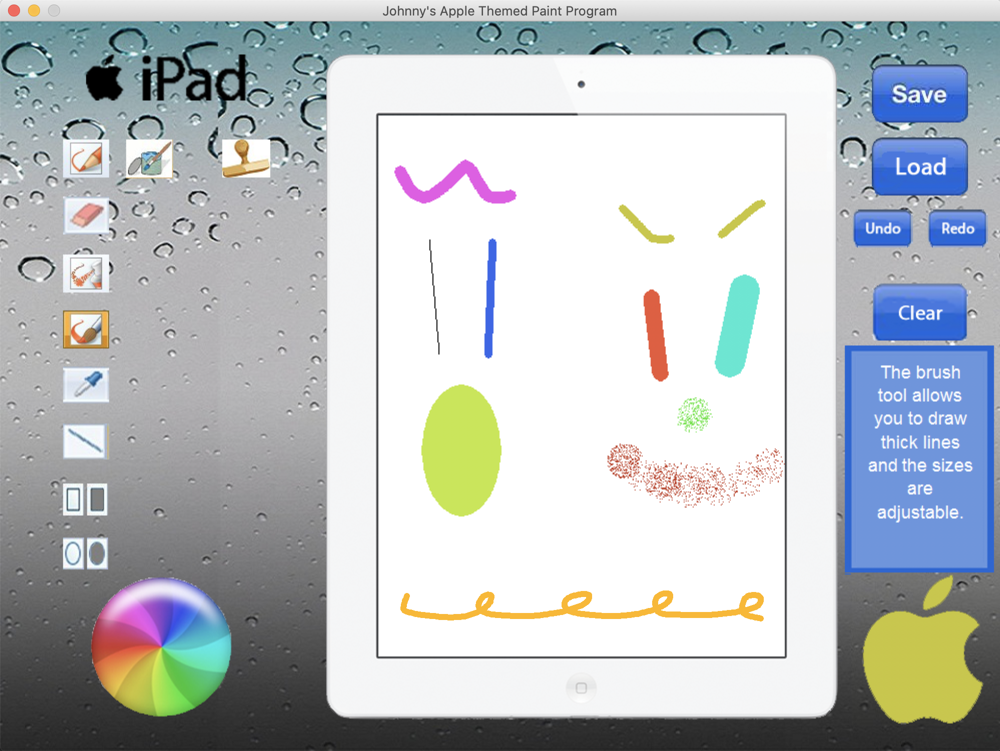
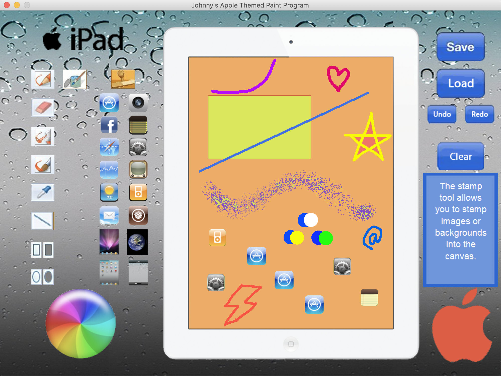

# Apple Themed Paint Program Made in Python

A fun, Apple-themed paint program used to replicate Microsoft Paint, created using Python and the Pygame library. 
Developed design and functionality from the ground up, with features including multi-tools, stamps, undo/redo edits, save/load functionality, adjustable sizing, and more. 

Runs on Python 2.7.2 and PyGame 1.9.1.

